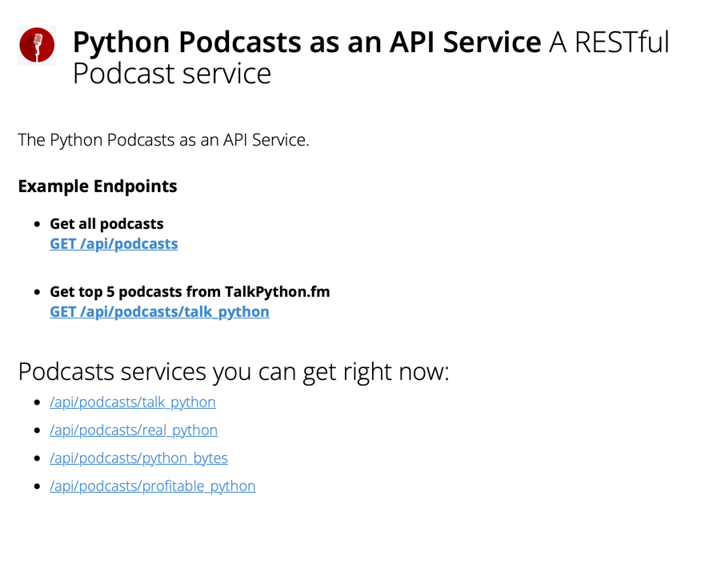

# The Podcaster API

[](https://github.com/girisagar46/pypodcaster/actions/workflows/unit-test.yaml)

This is a FastAPI application that provides a RESTful API for the Podcasts from different podcast's RSS feeds.
The API response is in JSON format and only contains top 5 podcasts from the source.

## About the project
- This project uses `feedparser` to parse RSS feeds and save the parsed content in a json file.
- The json file is saved in the `data` folder.
- In the `main.py` file, there's a function called `bootstrap_and_schedule` which is run every day to update the json file.
The main reason for using json file in this project is to make the application simpler and faster.
- Serving the JSON response directly from the json file is faster.

> TODO: In the future, we can use more robust data storage like Redis or PostgreSQL.

## Running it locally

1. [Install Poetry](https://python-poetry.org/docs/#installation) on your local machine.
2. Go into the root directory of the project and run the following command to install the dependencies:

   ```bash
   poetry install
   ```

3. Run the application:

   ```bash
   uvicorn main:api --host localhost --port=8000 --log-config log_config.json --reload
   ```

4. Visit [localhost:8000](http://localhost:8000) in your browser.

This is what index page looks like:



Play around with the API to see the response.
